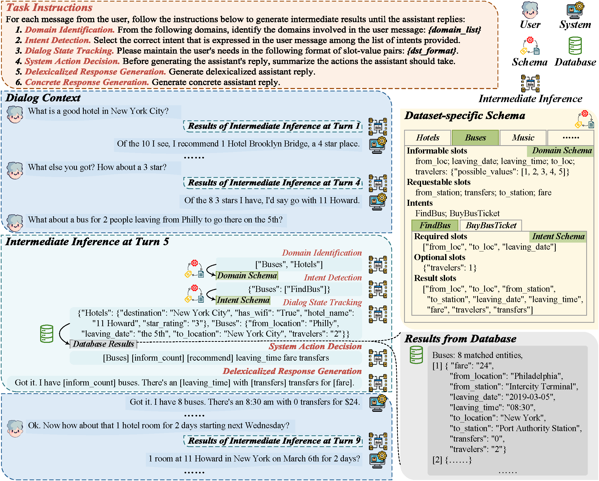
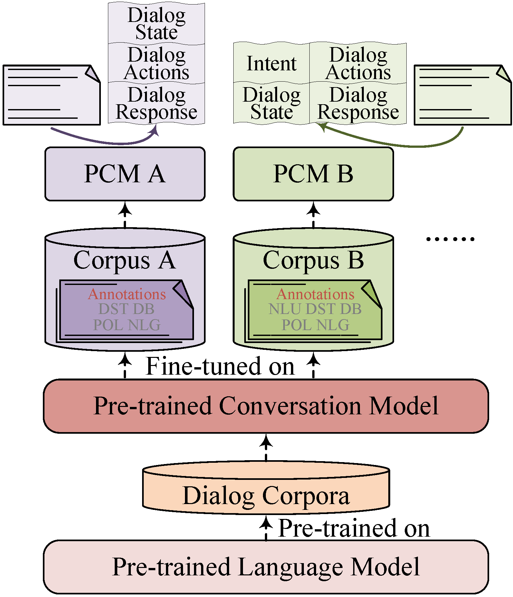
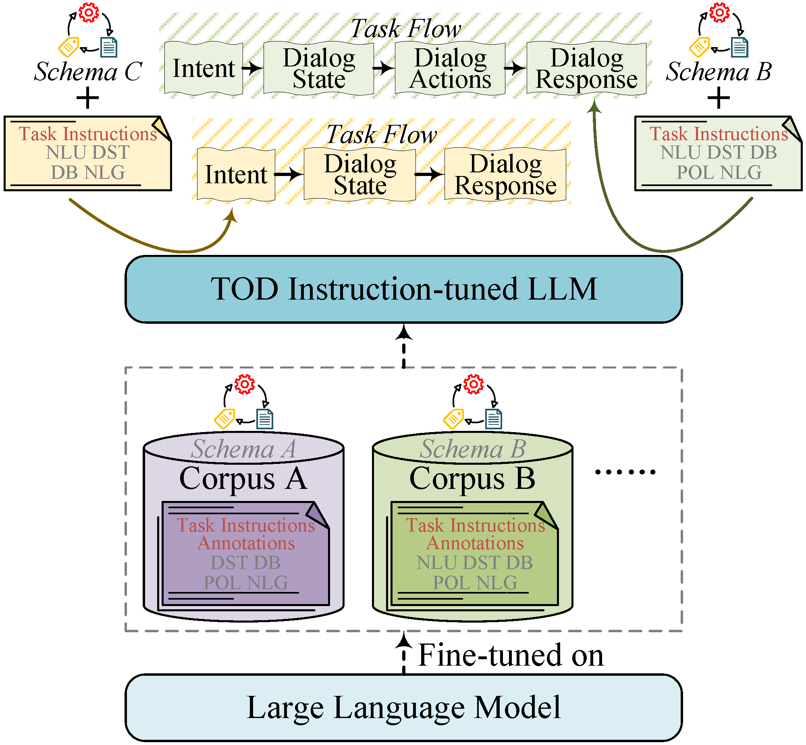

# ESAinsTOD: A Unified End-to-End Schema-Aware Instruction-Tuning Framework for Task-Oriented Dialog Modeling

[//]: # ([![DOI]&#40;https://img.shields.io/badge/DOI-10.12345/abcdef-blue.svg&#41;]&#40;https://doi.org/[在此处替换为您的论文DOI]&#41;)
[//]: # ([![License: MIT]&#40;https://img.shields.io/badge/License-MIT-yellow.svg&#41;]&#40;https://opensource.org/licenses/MIT&#41;)
[](https://www.python.org/downloads/)
[](./requirements.txt)
[](https://github.com/AaronTengDeChuan/ESAinsTOD)
[](https://github.com/AaronTengDeChuan/ESAinsTOD/commits/main)

---

**Dechuan Teng<sup>1</sup>, Chunlin Lu<sup>2</sup>, Libo Qin<sup>2</sup>, Wanxiang Che<sup>1</sup>**

<sup>1</sup> Harbin Institute of Technology, <sup>2</sup> Central South
University

[//]: # (**会议/期刊名称 年份** &#40;例如: CVPR 2025&#41;)

[//]: # (**[论文链接 &#40;例如ArXiv&#41;]&#40;https://arxiv.org/abs/xxxx.xxxxx&#41;** | **[项目主页 &#40;如果适用&#41;]&#40;&#41;** | **[Hugging Face &#40;如果适用&#41;]&#40;&#41;**)

\[ [English](README.md) | 中文 \]

### 摘要
#### Overview
<div>
    
</div>

#### Comparison between Conventional PCMs and Our Instruction-tuned LLM for TOD
<table>
  <tr>
    <td width=40%>
      
      <p style="text-align: center;">&#40;a&#41; Conventional PCMs</p>
    </td>
    <td width=49.5%>
      
      <p style="text-align: center;">&#40;b&#41; Our Instruction-tuned LLM for TOD</p>
    </td>
  </tr>
</table>

---

## 目录
- [环境搭建](#-环境搭建)
- [数据构建](#-数据构建)
  - [数据集准备](#数据集准备)
  - [指令微调数据集构建](#指令微调数据集构建)
- [预训练模型](#-预训练模型)
- [使用说明](#-使用说明)
  - [训练](#训练)
  - [推理和评估](#推理和评估)
- [主要结果](#-主要结果)
- [致谢](#-致谢)
- [联系方式](#-联系方式)

[//]: # (- [引用]&#40;#-引用&#41;)

---

## 🚀 环境搭建

我们建议使用 [Anaconda](https://www.anaconda.com/) 来管理您的 Python 环境。

**1. 克隆本仓库:**
```bash
git clone https://github.com/AaronTengDeChuan/ESAinsTOD.git
cd ESAinsTOD
```

**2. 创建并激活 Conda 环境:**

```bash
conda create --name your_env_name python=3.11 -y
conda activate your_env_name
```

**3. 安装依赖:**

  * **通过 pip 和 `requirements.txt` 安装:**

    ```bash
    pip install -r requirements.txt
    ```

*注意：请根据您的 CUDA 版本安装相应版本的 PyTorch。更多信息请参考 [PyTorch官网](https://pytorch.org/get-started/locally/)。*
    
**4. 其他:**

本项目使用 SpaCy 中的分词工具，您可以直接通过命令 `python -m spacy download en_core_web_sm` 安装资源。

运行以下代码下载资源 `punkt` 和 `wordnet`。

```python
import nltk
nltk.download('punkt')
nltk.download('wordnet')
```

-----

## 📦 数据构建
### 数据集准备
本工作从7个端到端对话数据集和4个语言理解数据集构建我们的微调数据。请按照以下说明下载和预处理数据集。
  - **下载链接**: 
    - [raw_datas.zip](https://drive.google.com/file/d/1a8wqzou0Wn_Z9p1ZrCuMzgOqU3wUv8Ta/view?usp=drive_link)
  - **数据集准备**: 将`raw_datas.zip`解压至项目根目录下的`raw_data/`文件夹中。
    ```bash
    # download raw_datas.zip and place it in './raw_data/' directory
    cd raw_data
    unzip -q raw_datas.zip
    ```
  - **目录结构**: 期望的数据集目录结构。
    ```
    📂 ESAinsTOD/
    └── 📂 raw_data/
        ├── 📂 bitod/
        ├── 📂 camrest/
        │   ├── ♾️ insert_raw_messages.py
        │   └── ...
        ├── 📂 frames/
        ├── 📂 kvret/
        ├── 📂 multiwoz_db/
        ├── 📂 multiwoz_2.0/
        ├── 📂 multiwoz_2.1/
        ├── 📂 multiwoz_2.1_released/
        ├── 📂 sgd/
        │   └── 📂 mix_1/
        ├── 📂 star/
        ├── 📂 single_turn/
        │   ├── 📂 banking/
        │   ├── 📂 clinc/
        │   ├── 📂 hwu/
        │   └── 📂 snips/
        ├── ♾️ insert_raw_messages.py
        ├── 📄 qwen25_special_tokens.json
        ├── ♾️ restore_text_pattern.py
        └── 📄 special_tokens.json
    ```

### 指令微调数据集构建
  - **文本标准化**:
    ```bash
    cd raw_data
    # For MultiWOZ 2.1
    python insert_raw_messages.py
    # For Camrest
    python camrest/insert_raw_messages.py
    ```
  - **相关脚本**: 所有用于数据集预处理和构建的脚本均位于 [`scripts/`](scripts/) 目录下:
    ```
    📂 ESAinsTOD/
    └── 📂 scripts/
        ├── 📂 e2e/
        │   ├── 🔡 multiwoz_process.sh
        │   └── ...
        ├── 📂 intent/
        │   ├── 🔡 banking.sh
        │   └── ...
        ├── 📂 slu/
        │   └── 🔡 snips_process.sh
        ├── 🔡 build_qwen25_instruct.sh
        ├── 🔡 common.sh
        └── ...
    ```
  - **构建指令微调数据**: 每个数据集的构建命令参考 [`scripts/build_qwen25_instruct.sh`](scripts/build_qwen25_instruct.sh) 脚本。
    ```bash
    bash scripts/build_qwen25_instruct.sh
    ```
    构建完成后，所有微调数据集将位于 `sft_data/qwen25/` 目录。
  - **合并数据集**: 将所有微调数据集合并为一个大数据集，供模型微调使用。
    ```bash
    # 修改 `tools/merge_datasets.py` 以控制合并哪些数据集
    python tools/merge_datasets.py
    ```
    合并后的数据集也位于 `sft_data/qwen25/` 目录下。

-----

## 🤖 预训练模型

我们提供了在几个LLMs上训练好的模型权重，方便您直接进行评估。

| 模型                  | 微调数据集                                                                   | 下载链接                                                                                                  |
|:--------------------|:------------------------------------------------------------------------|:------------------------------------------------------------------------------------------------------|
| Qwen2.5-3B-Instruct | 7 E2E Datasets (CamRest, In-Car, MultiWOZ2.1, SGD, Frames, BiToD, STAR) | [Google Drive](https://drive.google.com/file/d/1PV7ItNBW9aYC6K4k-Y669Ol23CjaRN0D/view?usp=drive_link) |
| Llama 2 7B          | 7 E2E Datasets                                                          | [Google Drive](https://drive.google.com/file/d/1LS4gCClAFIPeIJD1BmXLEJC_OpTT8WHN/view?usp=drive_link) |
| Llama 2 7B          | 7 E2E Datasets, 4 LU Datasets (BANKING77, CLINC150, HWU64, SNIPS)       | [Google Drive](https://drive.google.com/file/d/1zu9x_BJsVJRwgrgD_LobXLo1pUXq36b9/view?usp=drive_link) |

将下载的模型权重解压至 `saved_models/` 目录下，确保目录结构如下所示：

```
📂 ESAinsTOD/
└── 📂 saved_models/
    ├── 📂 qwen25-3b-instruct-e2e/
    ├── 📂 llama2-7b-e2e/
    └── 📂 llama2-7b-e2e-lu/
```

-----

## 🛠️ 使用说明

### 训练
推荐使用 [LLaMA-Factory](https://github.com/hiyouga/LLaMA-Factory) 进行 LLMs 的微调，查看 [fine_tuning/README_ZH.md](fine_tuning/README_ZH.md) 以获取详细的指导。

*您可以在 `fine_tuning/LLaMA-Factory` 目录下找到与训练相关的配置文件。*

### 推理和评估
得到微调的模型检查点（直接使用我们提供的检查点或自己从头开始微调）后，您可以通过运行以下推理脚本对这些数据集的测试集进行推理和评估

对于端到端对话建模（**E2E**）任务：
```bash
# inference and evaluation on MultiWOZ 2.1
bash scripts/eval/multiwoz21_infer.sh "llama2-7b"
# inference and evaluation on KVRET
bash scripts/eval/kvret_infer.sh "llama2-7b"
# inference and evaluation on CamRest
bash scripts/eval/camrest_infer.sh "llama2-7b"
```

对于意图识别（**ID**）任务：
```bash
# inference and evaluation on BANKING77
bash scripts/eval/banking_infer.sh
# inference and evaluation on CLINC150
bash scripts/eval/clinc_infer.sh
# inference and evaluation on HWU64
bash scripts/eval/hwu_infer.sh
```

对于口语语言理解（**SLU**）任务：
```bash
# inference and evaluation on SNIPS
bash scripts/eval/snips_infer.sh
```

-----

## 📊 主要结果

ESAinsTOD 仅通过一次微调即可同时实现意图预测、槽位填充、对话状态跟踪和端到端对话建模。

与最先进的方法相比，ESAinsTOD 在所有八个基准数据集上取得了超越或可比的性能，包括：BANKING77、CLINC150、HWU64、SNIPS、CamRest、In-Car Assistant、MultiWOZ2.0 和 MultiWOZ2.1。

### Backbone Model: *Llama 2 7B*

| Intent Prediction | BANKING77 | CLINC150 | HWU64 |
|:-----------------:|:---------:|:--------:|:-----:|
|     Accuracy      |   92.89   |  97.31   | 92.75 |

| Spoken Language Understanding | Intent Accuracy | Slot F1-score | Overall Accuracy |
|:-----------------------------:|:---------------:|:-------------:|:----------------:|
|             SNIPS             |      99.43      |     96.76     |      92.14       |

| End-to-End Modeling | Joint Goal Accuracy | Inform | Success | BLEU  | Combined Score |
|:-------------------:|:-------------------:|:------:|:-------:|:-----:|:--------------:|
|    MultiWOZ 2.0     |        55.90        | 94.30  |  87.10  | 21.48 |     112.18     |
|    MultiWOZ 2.1     |        58.68        | 94.40  |  87.50  | 21.41 |     112.38     |

| End-to-End Modeling | Match | SuccF1 | BLEU  | Combined Score |
|:-------------------:|:-----:|:------:|:-----:|:--------------:|
|       CamRest       | 98.50 | 88.45  | 26.92 |     120.39     |
|   In-Car Assistant  | 90.58 | 88.09  | 27.87 |     117.21     |

### Backbone Model: *Qwen2.5-3B-Instruct*

| MultiWOZ 2.1         | Joint Goal Accuracy |  Inform   |  Success  |   BLEU    | Combined Score |
|:---------------------|:-------------------:|:---------:|:---------:|:---------:|:--------------:|
| UBAR                 |        56.08        |   86.20   |   78.40   |   18.95   |     101.25     |
| PPTOD                |        54.19        |   92.00   |   83.50   |   19.80   |     107.55     |
| **ESAinsTOD**        |      **57.58**      | **94.70** | **86.70** | **19.90** |   **110.60**   |
| &emsp;&emsp;*w/o ia* |        56.84        |   93.30   |   81.90   |   19.39   |     106.99     |
| &emsp;&emsp;*w/o sa* |        53.53        |   87.20   |   80.00   |   19.45   |     103.05     |

-----

[//]: # (## 📜 引用)
[//]: # ()
[//]: # (如果您觉得我们的工作对您的研究有所帮助，请考虑引用我们的论文：)
[//]: # ()
[//]: # (```bibtex)
[//]: # (@article{[您的引用标签],)
[//]: # (  title={[论文标题]},)
[//]: # (  author={[作者一] and [作者二] and [作者三]},)
[//]: # (  journal={[期刊或会议名称]},)
[//]: # (  year={[年份]},)
[//]: # (  volume={[卷号]},)
[//]: # (  pages={[页码]})
[//]: # (})
[//]: # (```)
[//]: # ()
[//]: # (-----)

## 🙏 致谢
  - 本项目的部分代码参考了 [PPTOD](https://github.com/awslabs/pptod) 和 [SPACE-3](https://github.com/AlibabaResearch/DAMO-ConvAI/tree/main/space-3)。
  - 我们感谢 [LLaMA-Factory](https://github.com/hiyouga/LLaMA-Factory) 团队提供的强大工具，帮助我们高效地进行大模型微调。

-----

## 📧 联系方式

如果您有任何问题，欢迎通过以下方式联系我们：

  - **Dechuan Teng**: [email](mailto:dcteng@ir.hit.edu.cn)
  - 欢迎提交 [GitHub Issues](https://github.com/AaronTengDeChuan/ESAinsTOD/issues) 来报告bug或提出建议。